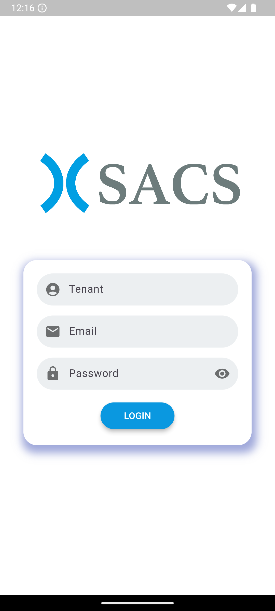
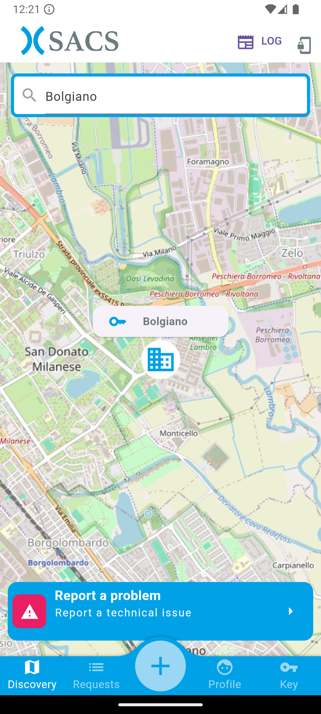
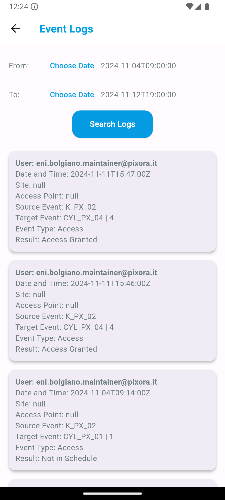
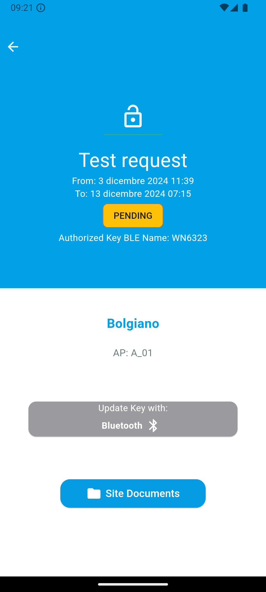
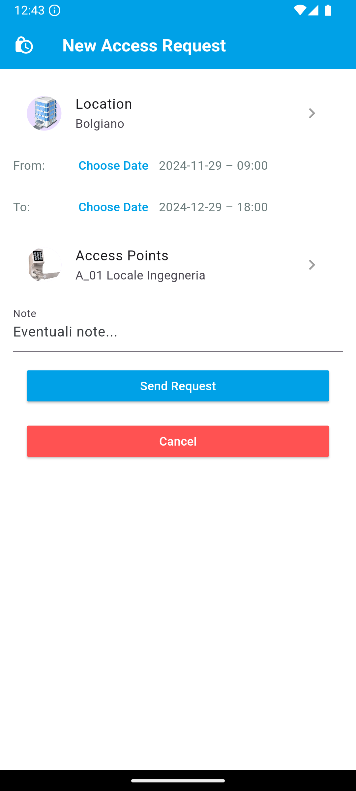
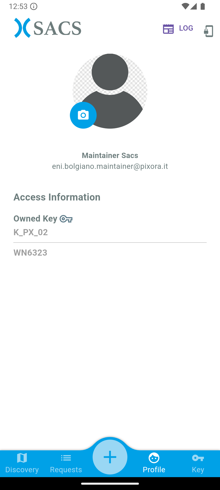
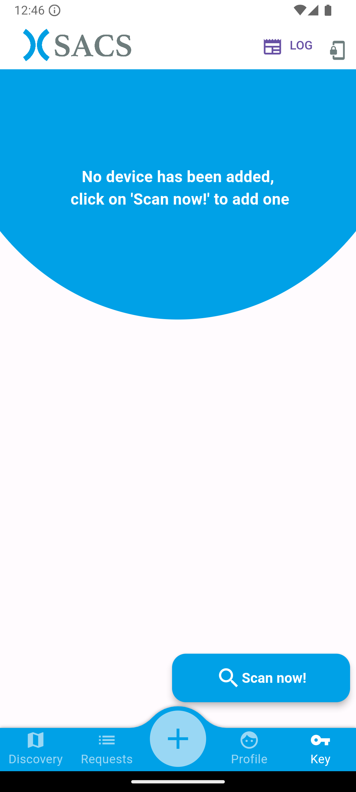

# Welcome to Sacs user guide.

## Login Screen

Per effettuare il log in è obbligatorio l’inserimento nei form dei seguenti campi: 

* `Tenant`: Nome identificativo dello specifico tenant abilitato.
* `Email`: La propria e-mail che rappresenta la chiave univoca dell’utente.
* `Password`: La propria password.

    

Dopo aver riempito i campi sarà possibile cliccare sul pulsante `LOGIN`.

In caso di credenziali errate, l'utente verrà informato con un messaggio d'errore.

In caso di credenziali corrette, l'utente passerà alla prossima schermata.

## Discovery Screen

In questa schermata, l'utente può cercare le `location` accessibili tramite chiave meccatronica (Bluetooth) utilizzando la barra di ricerca.

    

Una volta individuata una `location`, sarà possibile selezionarla per visualizzare i dettagli relativi all'ultima richiesta di accesso personale approvata, che verranno mostrati nella schermata dei dettagli (`Details Screen`).

Se non sono presenti richieste di accesso approvate, l'utente verrà informato con un messaggio.

## Logs Screen

In questa schermata, l'utente può visualizzare l'elenco dei log relativi alle attività svolte nell'applicazione.

    

La ricerca dei log avviene selezionando un intervallo di tempo, tramite due selettori di date, e cliccando sul pulsante `Search Logs`, consentendo di individuare rapidamente le informazioni desiderate.

Se la ricerca non produce alcun risultato, l'utente verrà informato con un messaggio.

## Requests Screen

In questa schermata, l'utente può visualizzare l'elenco delle richieste di accesso.

    

Selezionando una richiesta, si verrà reindirizzati alla schermata dei dettagli (`Details Screen`), dove verranno mostrate tutte le informazioni correlate.

## Details Screen

In questa schermata, l'utente potrà visualizzare i dettagli relativi alla richiesta di accesso selezionata.

    

Cliccando sul pulsante `Enter with: Bluetooth` sarà possibile aggiornare la chiave, a condizione che sia correttamente collegata. In caso contrario, verrà visualizzato un messaggio d'errore.

## New Request Screen

In questa schermata, l'utente può creare una nuova richiesta di accesso.

    

Per farlo, è necessario selezionare la `Location` desiderata, definire un intervallo di date, scegliere gli `Access Points` e inserire eventuali `Note` aggiuntive. Una volta completato il modulo, l'utente può cliccare sul pulsante `Send Request` per inviare la richiesta.

Se si desidera annullare l'operazione e tornare indietro, è sufficiente premere il pulsante `Cancel`.

## Profile Screen

In questa schermata, vengono visualizzate le informazioni relative al profilo utente, inclusa la chiave meccatronica (Bluetooth) associata.

    

## Devices Screen

In questa schermata, l'utente può cercare, accoppiare e gestire nuovi dispositivi.

    

Per avviare la ricerca, è necessario premere il pulsante `Scan now!`, che rileverà i dispositivi disponibili nelle vicinanze. Una volta individuato un dispositivo, questo verrà visualizzato nell'elenco. A questo punto, è possibile premere il pulsante `Connect` per stabilire la connessione. Dopo aver completato il collegamento, l'utente può premere il pulsante `Update` per aggiornare la chiave associata.