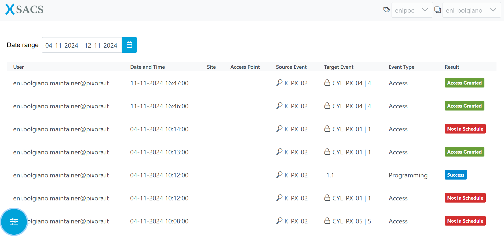
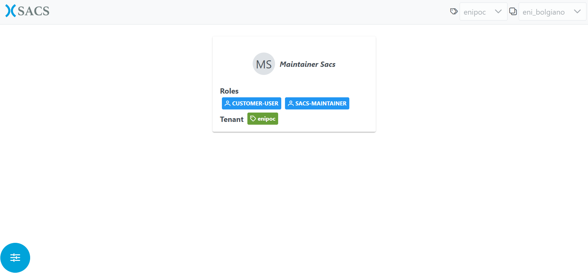

# Welcome to Sacs user guide.

## Login Page

Per effettuare il log in è obbligatorio l’inserimento nei form dei seguenti campi: 

* `Tenant`: Nome identificativo dello specifico tenant abilitato.
* `Email`: La propria e-mail che rappresenta la chiave univoca dell’utente.
* `Password`: La propria password.

    

Dopo aver riempito i campi sarà possibile cliccare sul pulsante `LOGIN`.

In caso di credenziali errate, l'utente verrà informato con un messaggio d'errore.

In caso di credenziali corrette, l'utente passerà alla prossima schermata.

## Home Page

In questa schermata, l'utente può accedere rapidamente a cinque sezioni principali:

* `Users Page`
* `Scheduled Access Page`
* `Audit Log Page`
* `Asset Page`
* `Documents Page`

    

Per accedere ad una di queste sezioni, è sufficiente cliccare sulla rispettiva opzione.

In basso a sinistra, è presente un pulsante che consente di accedere alla `Profile Page` o di effettuare il log out dall'applicazione.

Se l'utente sceglie di effettuare il log out, verrà reindirizzato alla schermata di log in, dove potrà inserire nuovamente le proprie credenziali di accesso.

**Nota bene:** L'accesso a tutte e cinque le sezioni è riservato agli utenti con permessi elevati. Gli altri utenti possono accedere unicamente alle seguenti pagine: `Scheduled Access Page`, `Audit Log Page` e `Documents Page`.

## Users Page

In questa schermata, l'utente può amministrare gli utenti registrati sulla piattaforma.

    

Le operazioni disponibili includono la creazione, la modifica, l'attivazione o la disattivazione degli utenti.

**Nota bene:** L'accesso a questa pagina e le relative operazioni sono riservati agli utenti con permessi elevati.

## Scheduled Access Page

In questa schermata, l'utente può creare e gestire nuove richieste di accesso.

    

Per creare una nuova richiesta di accesso, l'utente deve accedere alla pagina dedicata cliccando sul pulsante `Plan` presente nella `Home Page`, selezionare il `Site` e gli `Access Points` desiderati, specificare un intervallo di date e aggiungere una `Description`. Dopo aver compilato il modulo, è possibile inviare la richiesta cliccando su `Submit Request`.

    

Per gestire le richieste di accesso, l'utente deve accedere alla pagina dedicata cliccando sul pulsante `Dashboard` presente nella `Home Page`.

**Nota bene:** Solo gli utenti con permessi elevati possono gestire le richieste di accesso. Gli altri utenti possono esclusivamente crearne di nuove.

## Audit Log Page

In questa schermata, l'utente può visualizzare l'elenco dei log relativi alle attività svolte nell'applicazione.

    

La ricerca dei log avviene selezionando un intervallo di tempo tramite il selettore di date, permettendo di individuare rapidamente le informazioni desiderate.

## Asset Page

In questa schermata, l'utente può gestire gli asset.

    

**Nota bene:** L'accesso a questa pagina e le relative operazioni sono riservati agli utenti con permessi elevati.

## Documents Page

In questa schermata, l'utente può gestire i documenti relativi ad un `Site`.

    

È possibile:

* Caricare nuovi file/documenti utilizzando l'apposita funzione di `Upload`.
* Sfogliare l'elenco dei documenti disponibili, organizzati per il `Site` selezionato.
* Scaricare o eliminare i documenti di interesse selezionandoli dall'elenco.

**Nota bene:** Solo gli utenti con permessi elevati possono caricare o eliminare documenti. Gli altri utenti avranno accesso esclusivamente alla funzione di download.

## Profile Page

In questa schermata, vengono visualizzate le informazioni relative al profilo utente.

    

